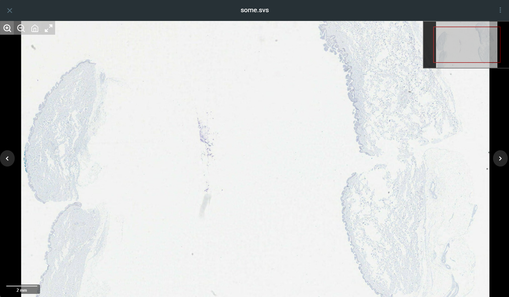

# FileBrowser-WSI: A Whole Slide Image Viewer Integration

This is a fork of the excellent **[FileBrowser-Quantum](https://github.com/gtsteffaniak/filebrowser)** project. The documentation for the original project has been preserved and can be found here: **[README.original.md](./README.original.md)**.

This fork has been extended with a native integration for viewing Whole Slide Images (WSI) directly in the browser. It preserves all the functionality of the original FileBrowser while adding a seamless experience for viewing medical and research images in formats like `.svs`, `.ndpi`, and more, powered by OpenSeadragon.

 ## Key Features

* **All Original Features:** Retains 100% of the functionality from the upstream FileBrowser-Quantum.
* **Native WSI Viewer:** Adds a fully integrated viewer for Whole Slide Images based on OpenSeadragon, which loads when a compatible file is selected.
* **Dynamic Scalebar:** A dynamic scalebar is rendered on top of the viewer, providing accurate measurements at any zoom level.
* **Backend Proxy:** Includes a secure backend proxy for the `slideserver`, ensuring that WSI tiles are served only to authenticated users.
* **Customizable Icons:** Viewer controls can be customized and are currently configured to load from a remote repository.

## How It Works

This fork uses a multi-container setup orchestrated by Docker Compose:

1.  **`filebrowser` Service:** The main application, built from this custom fork. It now includes a backend proxy to securely route requests for WSI tiles to the `slideserver`.
2.  **`slideserver` Service:** A lightweight Python/Flask microservice that uses `openslide-python` to read WSI files and serve up image tiles to the OpenSeadragon viewer.

## Configuration

To enable the WSI viewer, you must add the `integrations.wsi` block to your `config.yaml` file.

```yaml
# In ./config/config.yaml

server:
  port: 80
  internalUrl: "http://filebrowser:80"
  sources:
    - path: /srv
      name: main

auth:
  adminUsername: admin
  adminPassword: admin

integrations:
  wsi:
    # This URL is no longer needed as the proxy handles all requests.
    # It is kept for future compatibility but can be an empty string.
    url: ""
    
    # This URL is for internal communication between the containers.
    # It uses the service name 'slideserver' and its internal port.
    internalUrl: "http://slideserver:5000"
```

##Running the Application

This project is designed to be run with Docker Compose
1.  **Clone the repository:**
```bash
git clone [https://192.168.0.184:3100/miho/filebrowser.git](https://192.168.0.184:3100/miho/filebrowser.git)
cd filebrowser
```
2.  **Configure:** Create a `./config/config.yaml` file with the content described above.

3.  Run: Use the provided docker-compose.yml to build and start the services.
```bash
docker-compose up --build -d
```
3.  **Access:** You can now access your FileBrowser instance at `http://<your-ip>:38080`.


**Example** `docker-compose.yml`:

```yaml
version: "3.8"

services:
  filebrowser:
    build:
      context: .
      dockerfile: _docker/Dockerfile
    container_name: filebrowser_osdosintegrated
    user: "0:0"
    ports:
      - "38080:80"
    volumes:
      - /mnt/images:/srv
      - ./config:/config
      - ./database:/database
    environment:
      FILEBROWSER_CONFIG: "/config/config.yaml"
    restart: unless-stopped

  slideserver:
    build:
      context: ./slideserver
    container_name: slideserver_integrated
    volumes:
      - /mnt/images:/srv:ro
      - ./wsi-cache:/cache
    restart: unless-stopped
```
**Advanced Deployment: Multi-Machine Setup**
For improved performance and to distribute processing load, you can run the slideserver on a separate, dedicated machine. This is ideal if tile generation for large TIFF files is consuming too many resources on your main server.

This setup requires two machines on the same network.

**On Machine A: The FileBrowser Server**
This machine will run the main FileBrowser user interface and backend. It will proxy requests to the slideserver on Machine B.

Required Files:

Your complete FileBrowser project folder.

A `docker-compose.yml` file.

Your `config/config.yaml` file.

`docker-compose.yml` for Machine A:

This file should only contain the filebrowser service.

```YAML

version: "3.8"

services:
  filebrowser:
    build:
      context: .
      dockerfile: _docker/Dockerfile
    container_name: filebrowser_osdosintegrated
    user: "0:0"
    ports:
      - "38080:80"
    volumes:
      # These volumes allow you to browse the files, but are not strictly
      # needed for the viewer itself, which relies on the slideserver.
      - /mnt/images:/srv/main
      - /mnt/old-images:/srv/old-images
      - ./config:/config
      - ./database:/database
    environment:
      FILEBROWSER_CONFIG: "/config/config.yaml"
    restart: unless-stopped```
`config.yaml` for Machine A:

The `internalUrl` for the WSI integration must be updated to point to the IP address of Machine B.

```YAML

# In ./config/config.yaml on Machine A

integrations:
  wsi:
    # This URL points to Machine A (itself), as it's what the user's browser accesses.
    url: "http://<IP_OF_MACHINE_A>:38080"
    
    # This URL points to the real network IP and port of your dedicated slideserver.
    internalUrl: "http://<IP_OF_MACHINE_B>:5000"```

**On Machine B: The Dedicated SlideServer**
This machine's only job is to process images and serve tiles.

Required Files:

A new project folder containing:

The slideserver/ directory (with `app.py`, `tiff_handler.py`, etc.).

A new `docker-compose.yml` file.

`docker-compose.yml` for Machine B:

This file defines and exposes the slideserver service.

```YAML

# On Machine B: docker-compose.yml

version: "3.8"

services:
  slideserver:
    build: ./slideserver
    container_name: slideserver_only
    # Expose port 5000 to the host network so Machine A can reach it.
    ports:
      - "5000:5000"
    volumes:
      # This machine MUST have access to the same image files via a network share (NFS, etc.)
      - /path/to/shared/images:/srv/main:ro
      - /path/to/shared/old-images:/srv/old-images:ro
      - ./wsi-cache:/cache
    restart: unless-stopped

volumes:
  wsi-cache:```

Important Considerations
Shared Storage: For this to work, Machine B must have access to the exact same image files as Machine A. You must set up a network file share (like NFS or Samba/CIFS) and mount the directories on both machines.

Security: By exposing port 5000 on Machine B, the slideserver is now accessible on your network. It is highly recommended to use a firewall on Machine B to restrict access to port 5000 so that only the IP address of Machine A is allowed to connect.

To Launch
On Machine B, navigate to its project directory and run docker-compose up --build -d.

On Machine A, navigate to its project directory and run docker-compose up --build -d.